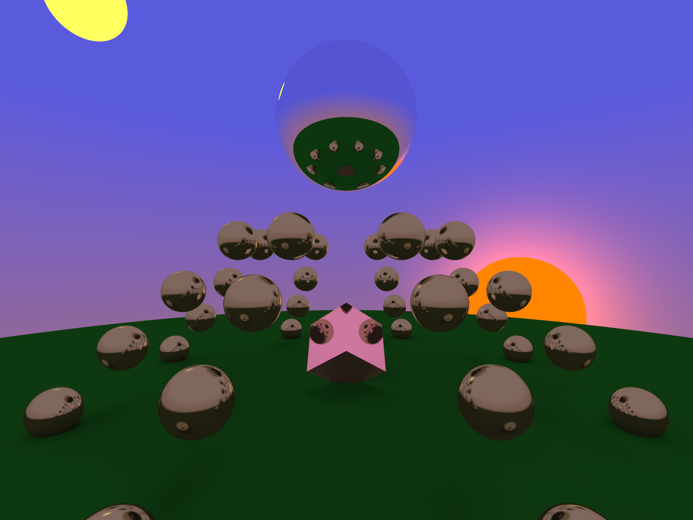

# Clumsy Ray-Tracer

Algorithms based on https://raytracing.github.io/books/RayTracingInOneWeekend.html.
Implementation and scene are my own.

# Use directly

To invoke the ray tracer from a terminal:

```bash
cargo run -p clumsy-rt --release
```

And if you want to play around with the settings:

```bash
N_THREADS=16 N_SAMPLES=32 SIZE_SCALAR=240 N_RECURSION=8 cargo run -p clumsy-rt --release
```

It will produce an image in `./out.png` which should look something like this:



# Use it as service (spin component)

The ray tracer can be used as a service that accepts rendering requests through
HTTP GET calls. This allows to collaboratively render an image in distributed
fashion.

For this demo, Fermyon Spin is used.
Take a look at the README in the sibling directory [spin-component](../spin-component/README.md) for more.
